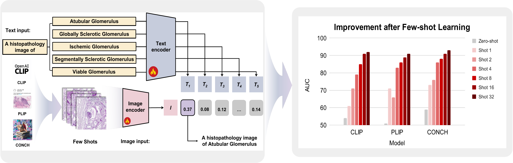
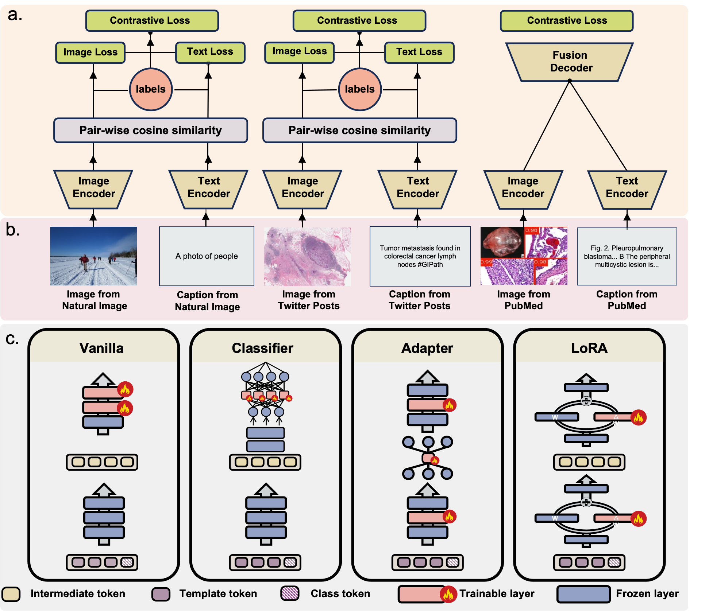

# From Classification to Cross-Modal Understanding: Leveraging Vision-Language Models for Fine-Grained Renal Pathology

## Overview
This is the official implementation of *From Classification to Cross-Modal Understanding: Leveraging Vision-Language Models for Fine-Grained Renal Pathology*.

This repository studies fine-grained glomerular subtyping under clinically realistic few-shot constraints. We compare general-purpose and pathology-specialized vision-language backbones, including CLIP, PLIP, and CONCH, across multiple adaptation strategies such as vanilla fine-tuning, LoRA, adapter tuning, and classifier tuning. Beyond standard classification metrics, the codebase also supports cross-modal representation analysis, including alignment, similarity-gap, geometry, calibration, and decision-boundary evaluation.

## Highlights
- Few-shot fine-grained renal pathology benchmark across multiple glomerular subtypes.
- Systematic comparison of CLIP, PLIP, and CONCH under multiple adaptation strategies.
- Joint evaluation of classification performance and cross-modal representation structure.

## Figures
<p align="center">
  
</p>

<p align="center">
  
</p>

The original pipeline figure is also available as a vector PDF: [Pipeline_Overview.pdf](./Pipeline_Overview.pdf).

## Abstract
Fine-grained glomerular subtyping is clinically important but expensive to annotate, making data-efficient learning essential in renal pathology. This repository accompanies a study that formulates glomerular subtyping as a few-shot vision-language learning problem and systematically compares general-purpose and pathology-specialized backbones under limited supervision. We evaluate CLIP, PLIP, and CONCH with several adaptation strategies, including vanilla fine-tuning, LoRA, adapter tuning, and classifier tuning. In addition to classification metrics such as accuracy, AUC, and F1, we analyze the geometry of the learned multimodal representations through alignment, similarity-gap, separability, calibration, and decision-boundary metrics. Across experiments, pathology-specialized backbones provide a stronger starting point in the few-shot regime, and vanilla fine-tuning emerges as the most reliable high-performing adaptation strategy. Overall, the repository is intended to support inspection of how supervision level, backbone choice, and adaptation method jointly shape both classification behavior and cross-modal representation quality.

## Repository Structure
- `Data_Processing/`: patch preprocessing and few-shot split generation utilities.
- `Train_Test_Code/`: training code for CLIP, PLIP, and CONCH using vanilla fine-tuning, LoRA, adapter tuning, and classifier-based adaptation.
- `Evaluation/`: post-training analysis for classification metrics, alignment and similarity analysis, feature-space geometry, calibration and boundary metrics, and visualization utilities such as ROC and boxplot generation.
- `environment.yml`: recommended Conda environment specification for reproduction.
- `requirements.txt`: pip-based environment alternative.

## Environment Setup
The recommended setup path is Conda:

```bash
conda env create -f environment.yml
conda activate conch_env
```

An alternative pip-based setup is also provided:

```bash
pip install -r requirements.txt
```

For full reproduction, `environment.yml` is the preferred option. Depending on the platform, some components such as OpenSlide may also require system-level installation.

## What This Repository Currently Includes
This release currently includes preprocessing code, training code, evaluation code, and environment definitions used in the study. It does not include the underlying datasets. Model weights will be added in a future update.

Some experiment scripts reflect the research pipeline used for the paper and may require adaptation to user-provided local data and result directories.

## Data
In accordance with institutional regulations and to safeguard patient privacy and confidentiality, the datasets analyzed in this study are not publicly released in this repository.

## Model Weights
Coming soon.

## Paper
**Current paper:** [From Classification to Cross-Modal Understanding: Leveraging Vision-Language Models for Fine-Grained Renal Pathology](https://arxiv.org/abs/2511.11984)

This work extends our earlier study, [Glo-VLMs: Leveraging Vision-Language Models for Fine-Grained Diseased Glomerulus Classification](https://arxiv.org/abs/2508.15960), by moving beyond classification-only evaluation toward cross-modal representation analysis, calibration, decision-boundary analysis, and a broader comparison of adaptation behavior under few-shot supervision.

## Citation
If you find this repository useful, please cite the current paper:

```bibtex
@article{guo2025classification,
  title={From Classification to Cross-Modal Understanding: Leveraging Vision-Language Models for Fine-Grained Renal Pathology},
  author={Guo, Zhenhao and Saluja, Rachit and Yao, Tianyuan and Liu, Quan and Zhu, Junchao and Wang, Haibo and Reisenb{\"u}chler, Daniel and Huo, Yuankai and Liechty, Benjamin and Pisapia, David J and others},
  journal={arXiv preprint arXiv:2511.11984},
  year={2025}
}
```

For the earlier version of this research direction, please also consider citing:

```bibtex
@article{guo2025glo,
  title={Glo-vlms: Leveraging vision-language models for fine-grained diseased glomerulus classification},
  author={Guo, Zhenhao and Saluja, Rachit and Yao, Tianyuan and Liu, Quan and Huo, Yuankai and Liechty, Benjamin and Pisapia, David J and Ikemura, Kenji and Sabuncu, Mert R and Yang, Yihe and others},
  journal={arXiv preprint arXiv:2508.15960},
  year={2025}
}
```
